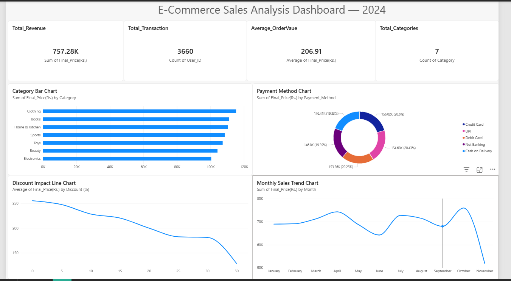

# E-Commerce Sales Analysis Dashboard

## Project Overview
This project analyzes e-commerce transaction data to uncover 
business insights around revenue, customer behavior, payment 
preferences, discount strategy, and monthly sales trends.

Built using SQL for data analysis and Power BI for visualization.

---

## Dashboard Preview

---

## Business Questions Answered
1. What is the overall business performance?
2. Which product category generates the highest revenue?
3. Which payment method do customers prefer?
4. How does discounting impact revenue?
5. What are the monthly sales trends?

---

## Key Insights
- **Clothing** is the top revenue-generating category (₹1,15,000+)
- **Electronics** has pricing issues — similar transaction volume 
  to Clothing but significantly lower average order value (₹201 vs ₹217)
- **Credit Card** dominates transaction volume but 
  **Cash on Delivery** customers have the highest average order value
- **Discounts are hurting revenue** — transaction volume stays 
  flat across all discount levels (412–480 transactions) but 
  average order value drops sharply from ₹255 (0% discount) 
  to ₹128 (50% discount)
- **October is the peak sales month** — likely driven by 
  Dussehra and pre-Diwali festive shopping
- **Zero repeat customers** detected — every customer purchased 
  only once, indicating a customer retention problem

---

## Recommendations
1. Cap discounts at 15–20% maximum — higher discounts 
   hurt revenue without increasing sales volume
2. Investigate Electronics pricing strategy — consider 
   premium product bundles to increase average order value
3. Launch a customer loyalty program — zero repeat purchases 
   is a critical retention issue
4. Maximize marketing budget in September–October 
   for festive season
5. Convert Cash on Delivery customers to digital payments 
   — they are high-value buyers and digital payments reduce 
   operational costs

---

## Tools Used
- **SQL** (SQLite) — data extraction and analysis
- **Power BI** — interactive dashboard and visualization
- **Dataset** — E-Commerce Dataset from Kaggle (3,660 transactions)

---

## Files in this Repository
| File | Description |
|---|---|
| `ecommerce_analysis.sql` | All 5 SQL queries with business analysis |
| `Ecommerce_Sales_Analysis.pbix` | Power BI dashboard file |
| `ecommerce_dataset_updated.csv` | Raw dataset from Kaggle |
| `dashboard_preview.png` | Dashboard screenshot |

---

## Author
**Arjun Harish**  
Aspiring Data Analyst | SQL | Power BI | Power Platform  
📧 arjunhebbar2711@gmail.com
